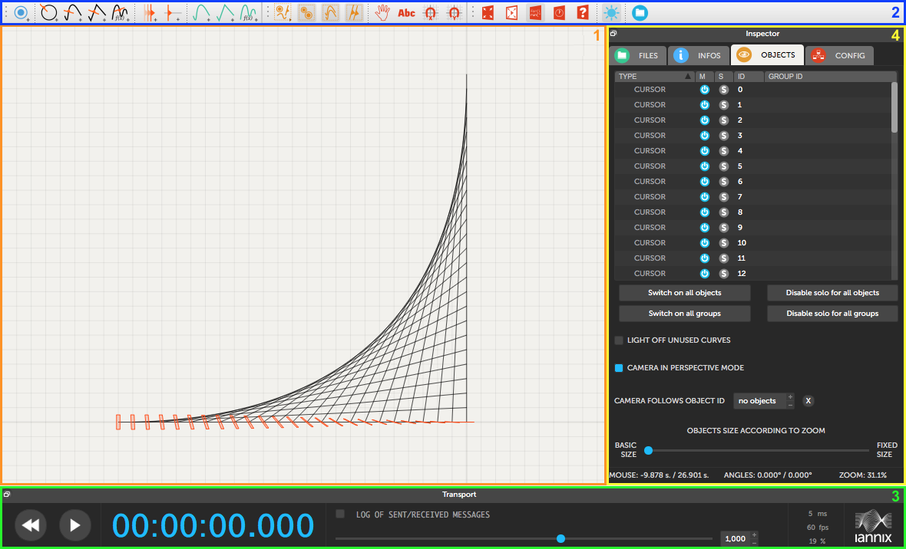
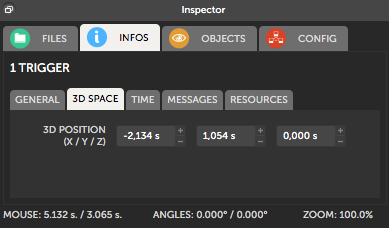
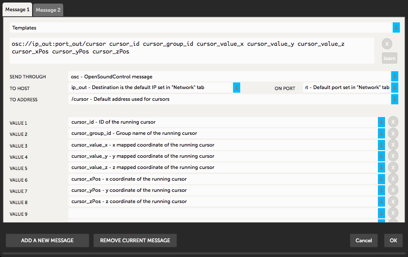
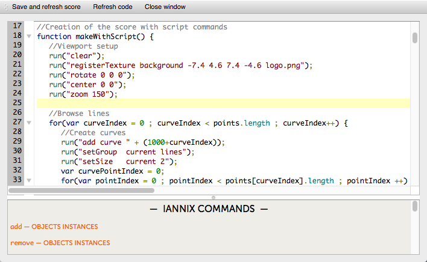

IanniX user interface comprehends a main window with operative functions that allow the user to create, edit, and play their own scores. Additionally, a series of secondary windows is supplied for visualization purposes, editing, and support.

2.1 Main window
---------------------

Based on a user-friendly graphical approach, it represents the basic interface between user and score. Most actions can be carried out through this window, which is divided into four parts:



**Fig. 1. Main window divided into four sections.**

1. **visualization**; the score rendering area consists in a representation of a three-dimensional space for viewing and manipulating IanniX objects directly;
2. **creation**; a toolbar allows for drawing and adding default objects to the score and for setting up several display options;
3. **position**; this panel includes transport controls and performance settings;
4. **inspection**; it shows file browser, object list, attributes, resources, and configuration.

### 2.1.1 Visualization

Users can navigate throughout the score by means of mouse (or trackpad) and keyboard:

* `click+drag` to scroll in the score;
* `mouse wheel` to zoom in and out;
* `alt+click+drag` to rotate the viewport;
* `alt+mouse wheel` to change the viewport distance;
* `alt+double click` to reset the viewport position.

Score editing functions are available when the viewport is set in its default position (i.e. without rotation):

* `click` to select a IanniX object;
* `shift+click` to select multiple objects;
* `click+drag` to move the objects;
* `ctrl+alt+drag` to enable grid snapping (`cmd key` on Mac).

In order to facilitate objects positioning, grid and axes are displayed as a space-time reference; by default, a grid unit corresponds to one second in time sequencing. Grid resolution and display options can be customized from *Menu bar / Display*. Also, selected objects can be aligned and distributed automatically from *Menu bar / Arrange objects*.

### 2.1.2 Creation

IanniX objects (cf. Chap. 3) can be drawn and added directly to the score by selecting them from the *Objects creation* toolbar:


**Fig. 2. *Objects creation* toolbar.**

1. add a trigger;
2. add a circular curve with a cursor;
3. draw a smooth curve with a cursor;
4. draw a straight curve with a cursor;
5. add a parametric curve with a cursor;
6. add a cursor on selected curves;
7. add a timeline;
8. draw a smooth curve;
9. draw a straight curve;
10. add a parametric curve.

In drawing mode, a `click` on the score sets a point of the curve; `esc` exits this mode. After creating a curve, the user can also modify it: `double click` on the path to add a point on the curve; `ctrl+double click` to remove it (`cmd key` for Mac users); `double click` on a point to enable or disable smoothing.

Cursors and triggers are capable of sending messages through various protocols (cf. Chap 4.1); `double click` on an object to open the Message editor. For testing purposes, with `shift+double click` the user can force a selected object to send its messages.
In addition to default IanniX objects, the user can import background images, text and SVG files (to be converted into IanniX curves) from *Menu bar / File*.

Further features are available from the *View options* and *Window options* toolbars:


**Fig. 3. View and window options.**

1. restrict message output capability to selected objects;
2. enable or disable trigger selection;
3. enable or disable curve selection;
4. enable or disable cursor selection;
5. lock objects position to avoid accidental changes;
6. show or hide object labels; 
7. snap mouse actions to vertical grid;
8. snap mouse actions to horizontal grid;
9. show score (*Render*) in fullscreen;
10. enable or disable the *Render* in a separate window;
11. show or hide the *Script editor* (cf. Chap. 2.2.1);
12. enable or disable the *Timer* in a separate window;
13. show or hide the *Helper* window;
14. change IanniX color theme (light or dark); 
15. open *Patches* folder containing interfacing examples.

### 2.1.3 Position

The *Transport* panel includes the main sequencing controls for moving along the score (i.e. play, stop, and fast rewind) and for changing the global playback speed through a multiplication factor. It also integrates IanniX performance settings:


**Fig. 4. *Transport* panel.**

* an instantaneous message log that displays the last message sent or received;
* the scheduler period, which is the interval between two computed events; its default value is 5 milliseconds, but can be adjusted by the user with the awareness that custom values considerably affect IanniX performance, messages accuracy, and CPU usage;
* the rendering frame rate, that is the refresh speed of the displayed score; values between 30 and 50 frames per second are reasonable;
* the CPU usage; processor load can be optimized by disabling message logs and object labels, and by adjusting scheduler period and rendering frame rate.

### 2.1.4 Inspection

The *Inspector* panel is an essential tool for the management of IanniX scores and objects, and for the configuration of communication interfaces. It is subdivided into four tabs:



**Fig. 5. *Inspector* panel.**

* *FILES*; a file browser for the management of IanniX scores;
* *INFOS*; through this section, users can visualize and edit object attributes (cf. Chap. 3) as well as global colors and textures; features are ordered into five further tabs: *General*, *3D Space*, *Time*, *Messages*, and *Resources*;
* *OBJECTS*; this shows a list of all objects included in the current score, and also permits selection, *mute* and *solo* functions for each object (cf. Fig. 1);
* *CONFIG*; a section which comprehends a full message log as well as the configuration of supported interfaces: *Network* (cf. Chap. 5.1), *MIDI* (cf. Chap. 5.2), *Arduino* (cf. Chap. 5.2), and *Software* (cf. Chap. 5.4).

2.2 Secondary windows
---------------------

From the main window, the user can access to additional resources:

* *Message editor* (cf. Fig. 6); this window is used to set up the score data to be sent to external devices or IanniX itself (cf. Chap. 5.4.1); every cursor or trigger is capable of sending messages defined by communication protocol, address, and a series of variables (cf. Chap. 4.1);
* *Render (performance mode)*; in this mode, the user can take advantage of dual display output, for instance by using the second output to make a video projection while keeping preview and control of the score on the main display;
* *Timer*; an additional window that displays the timecode;
* *Helper*; the help window is a useful resource for the assistance on actions performed through graphical user interface; it shows specific tips and advice as well as a list of IanniX commands corresponding to user actions;
* *Script editor*; this allows the user to edit the score file.



**Fig. 6. Message editor.**

### 2.2.1 Script editor

The script editor offers an advanced approach to score through JavaScript language, which underlies IanniX score files. Even with a limited knowledge of JavaScript, various features can be implemented (cf. Chap. 5.4.1). Also, the lower section of its window shows a summary of functions, commands, and variables, with a view to adding them easily in the script.



**Fig. 7. Script editor.**

IanniX introduces a specific function for sending commands to the sequencer in order to perform an action in the score: `run()`. Commands must be provided to `run()` as a single string. General syntax is always:
```
run("<command name> <target> <arguments>");
```
For example:
```
run("setPos current 0 0 0");
```
sets the position of current object to the center of the score (X=0; Y=0; Z=0). A list of custom functions can be consulted from the JavaScript Library included in the software package.

Commands are described extensively in Chap. 4.2; still, users can learn them in a practical manner by performing actions through graphical user interface and then finding the corresponding syntax from the *Helper*.
 
Possible targets are: an object ID (number), a group ID (string name of the object group), `all` (all objects), `current` (last used ID), and `lastCurve` (last used curve).

To combine numeric variables with text commands, the concatenation operator (`+`) must be used in order to produce a string. For example:
```
run("setPos current " + x_value + " " + y_value + " 0");
```
sets the position of current object according to user-defined variables (`x_value` and `y_value`).

Overall, a score file usually comprises six sections defined by JavaScript methods:

* `askUserForParameters()`; this method is called first, as it permits the user to set global variables for the subsequent generation of the score through script; the syntax is:
   ```
  title("<displayed box title>");
  ask("<menu label>", "<parameter label>", "<parameter name>", <default value>);
   ```
* `makeWithScript()`; this core section is reserved to user input of code for the generation of the score (cf. Fig. 7); actions and operations are performed at the opening of a IanniX file;
* `onIncomingMessage(protocol, host, port, destination, values)`; this method is called when an incoming message is received; it is used to correlate scripts with specific input messages; for example, the position on X axis of an object (ID=3) can be adjusted by an external device that communicates through OSC protocol (cf. Chap 5.3.1):
   ```
   if((protocol == "osc") && (destination == "/1/fader1")) {
   var x_position = parseFloat(values[0]);
   run("setPos 3 " + x_position + " 0 0");
   }
   ```
* `madeThroughGUI()`; this method stores all actions made through graphical user interface; users should not edit this section, as it is automatically overwritten when score is saved;
* `madeThroughInterfaces()`; this method stores the actions made by third-party devices through compatible interfaces; even in this case, users are not allowed to make changes from the script editor;
* `alterateWithScript()`; this method is called last for enabling the user to add scripts with highest priority; it can be used to modify a hand-drawn score or to remove changes added accidentally by external commands.
---

Copyright (C) 2016-2017 - Julian Scordato (original author)  
Adapted and maintained (C) 2026 - Zhengchao Ding  
Licensed under [Creative Commons Attribution-ShareAlike 4.0 International](https://creativecommons.org/licenses/by-sa/4.0/)
