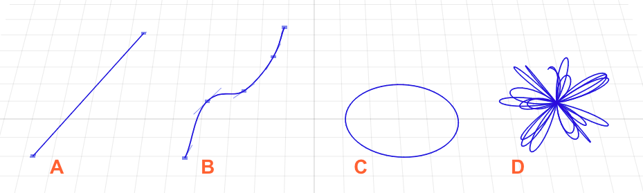
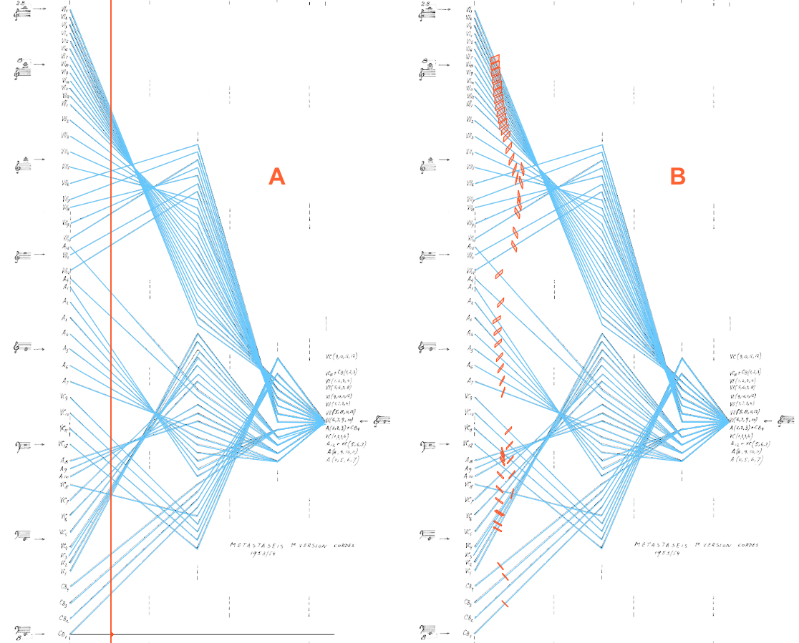
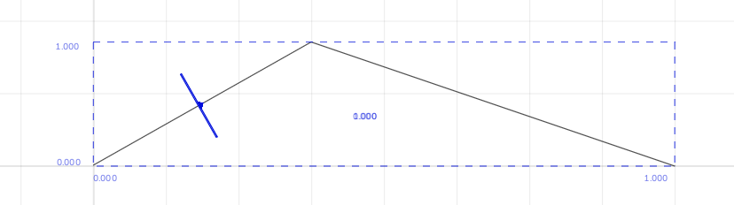
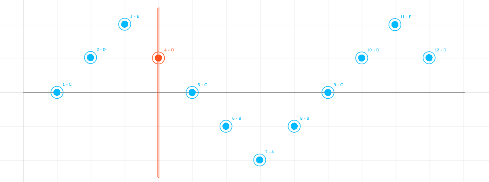
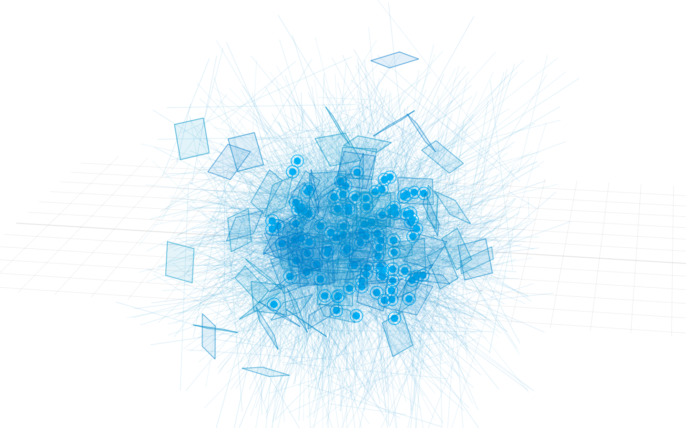

IanniX scores are built combining three types of abstract objects – curves, cursors, and triggers – in a three-dimensional representation system. Objects can be arranged through IanniX GUI (cf. Chap. 2.1.2), JavaScript (cf. Chap. 2.2.1), or commands received from applications that use a compatible network protocol (cf. Chap. 5.1). Changes in the score can also be made during the performance.

In the definition of a score, every IanniX object has a series of general attributes that are customizable by the user: 

* *ID*; an identification number used to send messages and receive commands uniquely;
* *group ID*; a string suitable to control various objects together;
* *activation status*; it determines whether an object is enabled or disabled in the score; when an object is disabled, it can not send any messages;
* *thickness / size*; this attribute is defined by a floating-point number;
* *label*; a string used mainly for display purposes;
* *color*; it can be chosen from a standard or custom color palette;
* *texture* (only for cursors and triggers); external graphics can be imported to change object's default appearance;
* *messages* (only for cursors and triggers); single or multiple output messages can be set (cf. Chap. 4.1);
* *3D position* (only for curves and triggers); it sets the object's position in the score according to X, Y, and Z axes; values are expressed in seconds [s] in order to establish a correspondence with the sequencing time of cursors.

In addition, every object type holds specific properties, functions, and attributes which are described in the chapters below.

3.1 Curves
----------

In IanniX vocabulary, a curve is a vector-based path defined by a set of points. Each section of a curve can take three forms: a line segment (cf. Fig. 8-A), a cubic Bézier curve (cf. Fig. 8-B), or an ellipse (cf. Fig. 8-C). Also, curves can be generated by mathematical equations (cf. Fig. 8-D).

**Fig. 8. Curve types: straight (A), smooth (B), circular (C), and parametric (D).**

As vectors, IanniX curves have certain properties such as being interpolable, scalable, and resampleable. Operations on curves and their single points can be made from *Inspector / INFOS / 3D Space* or with a direct manipulation of the score (cf. Chap. 2.1.2) as well as through action-equivalent scripts (cf. Chap. 4.2).

Curves can assume different functions in a score; if linked to one or more cursors, they constitute their support by defining the their path; while in other circumstances, such as in reactive scores (cf. Chap. 1.2), curves may simply represent a graphical artifact. When a curve is located within the range of a cursor linked to another curve, it can describe the variation of values read by such cursor. Indeed, unlike cursors and triggers, curves do not output any message.

3.2 Cursors
-----------

While the *Transport* panel acts as global sequencer (cf. Chap. 2.1.3), IanniX cursors perform local sequencing functions. They can be considered as reading heads of specific triggers and curve values. For this reason they represent the core of the poly-temporal feature.

Implications of poly-temporality involve specific space-time relations, as demonstrated by the score implementation of Xenakis's *Metastaseis*, which is part of IanniX examples.

**Fig. 9. Cursors in Xenakis's *Metastaseis* example: mono-temporality (A) vs poly-temporality (B).**

By moving along the curves, cursors are able to produce continuous messages related to a three-dimensional portion of the score included in their range, which is defined in terms of width and depth. For example, they can report their current position as well as values related to colliding curves and triggers (cf. Chap. 4.1). The rate of messages sent over time can be configured from *Inspector / INFOS / Messages*. Moreover, when a trigger is found in their range, cursors have the function to start it and make it produce any instant messages (cf. Fig. 11).

An important aspect to consider when the cursors send positioning values is the coordinate mapping. Included in *Messages* tab, this feature allows the user to rescale the virtual space of the score to the desired range of values needed by the receiver for controlling a specific parameter (e.g. sound frequency or amplitude). X, Y, and Z values can be mapped according to four modes:

**Fig. 10. Example of coordinate mapping.**

* from 0 to 1 on the bounding rectangle of the curve where the cursor moves on (cf. Fig. 10);
* from 0 to 1 on the bounding rectangle of the support curve including cursor size;
* from 0 to 1 on global score bounding rectangle;
* user-defined custom mapping.

The cursor movement is subject to global transport controls. However, cursors have several specific attributes that define their own behavior in the score:

* *cursor width* [s]; this attribute defines the size of the two-dimensional range; values are measured according to the time grid reference (cf. Chap. 2.1.1);
* *cursor depth* [s]; it extends the range to the Z axis;
* *cursor speed / length*; the former is a factor related to global playback speed, while the latter establishes a fixed value of duration [s] to the cursor's path along its support curve;
* *cursor master speed*; it applies a multiplication factor to the attribute above; the default value is 1, while 0 is used to stop the cursor;
* *loop pattern*; it can be one run (1 0), loop (1), single round trip (1 -1 0), or loop round trip on curve (1 -1);
* *easing curve*; it handles the cursor acceleration on the support curve; the acceleration type can be chosen from 44 presets.
* *offset* [s]; this attribute is used to change the loop interval and starting position; negative values introduce a delay before the start.

3.3 Triggers
------------

In their default appearance, triggers are spherical objects with the ability to send single messages in the event of a spatial collision with a cursor. In a sense, they can be compared to musical notes, as they involve discrete events over time.

**Fig. 11. Trigger fired by a cursor that moves along a timeline.**

For example, triggers can produce MIDI note messages to play a sequence of sounds on an external MIDI device (cf. Chap. 5.2). In this case, the trigger-specific *duration* attribute should be set for each note according to needs. However, triggers are able to control any sort of event, from operations on data flow to final media, depending on the software or hardware linked to IanniX. 

The three-dimensionality of space may lead to unusual ways of conceiving a score.

**Fig. 12. Triggers, cursors, and curves in a 3D score example (*Random 3D lines.iannix*).**
---

Copyright (C) 2016-2017 - Julian Scordato (original author)  
Adapted and maintained (C) 2026 - Zhengchao Ding  
Licensed under [Creative Commons Attribution-ShareAlike 4.0 International](https://creativecommons.org/licenses/by-sa/4.0/)
