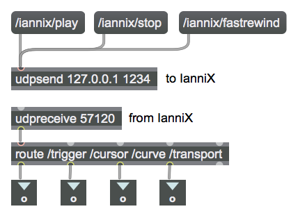
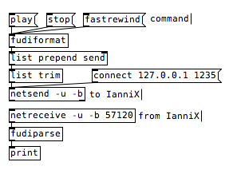
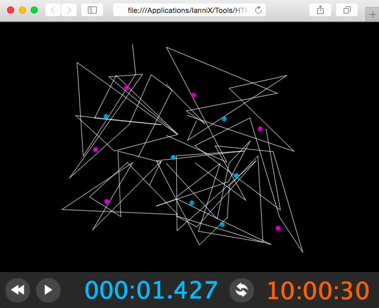
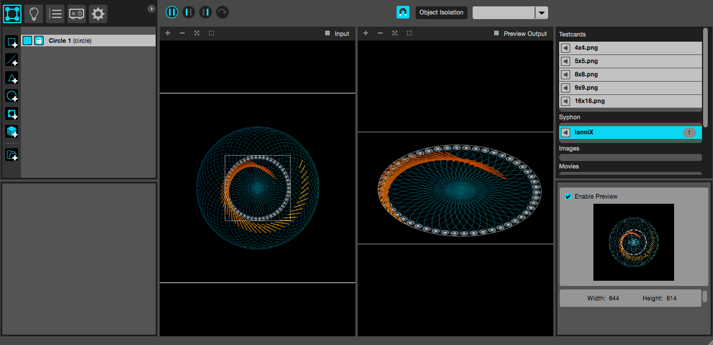

IanniX is not intended for a self-sufficient and exclusive use. Therefore, it implements various communication protocols and interfaces in order to connect with a wide range of software and hardware.

Methods of interaction and respective settings will be examined, also with supporting examples.

5.1 Network protocols
---------------------

IanniX is capable of sending data to and receiving data from devices connected to local or remote networks. Supported network protocols are OSC, raw UDP, TCP, and HTTP. As a consequence, this feature significantly expands software interfacing possibilities and interaction strategies.

### 5.1.1 OSC

[OSC](http://opensoundcontrol.org/introduction-osc) (OpenSoundControl) is a message-based protocol for the communication between computers, sound synthesizers, and other multimedia devices that is optimized for modern networking technology. OSC is currently implemented in a wide range of computer applications, including IanniX as a control-message-generating software.

OSC message packets are typically transmitted via [UDP](https://en.wikipedia.org/wiki/User_Datagram_Protocol) (User Datagram Protocol) to an IP address on a destination network port:
```
osc://<IP address>:<destination port>/<message>
```
For example:
```
osc://192.168.1.3:57120/transport play 1
```
Since OSC does not provide any mechanism for clock synchronization, OSC time tags are used in the transmission of OSC bundles for temporal representation.

In IanniX, OSC settings can be configured from *Inspector / CONFIG / Network*.

A convenient way to route and manage OSC messages from and to IanniX foresees the communication with a third-party programming environment. For instance, [Max](https://cycling74.com/products/max/) allows for audio/video processing by means of a programmable data flow that can be also controlled via OSC; an example is included in IanniX software package (*Patches/Max/Max Sound Example.maxpat*).

Communication between Max and IanniX takes places via two objects: *udpreceive <inbound port>* and *udpsend <host IP> <outbound port>*. Conventionally, when both applications run on the same local machine, the IP address must be set to 127.0.0.1 (or *localhost*). Otherwise, IP should be set according to network preferences.



**Fig. 13. OSC message routing in Max programming environment.**

### 5.1.2 Raw UDP

This protocol is used to send and receive messages through a very common method for the transport of data over the Internet. Analogously to OpenSoundControl, raw UDP packets employ a reduced data bandwidth at the expense of unreliability that characterizes unidirectional communication: when a message is sent over UDP, there is no computational way to verify whether it will be actually received.

For instance, messages may be transmitted to control the sequencer with [Pure Data](https://puredata.info) programming environment.



**Fig. 14. Example of communication with Pure Data.**

In Pure Data, netsend object must be initialized with a message: 
```
connect <IP address> <destination port>
```
Messages should pass through *fudiformat* and *fudiparse* objects in order to be formatted correctly. 
A Pure Data patch for basic communication is provided by IanniX (*Patches/PureData/PureData Example.pd*).

### 5.1.3 TCP and WebSocket

Another common network protocol which is compatible with IanniX is [TCP](https://en.wikipedia.org/wiki/Transmission_Control_Protocol) (Transmission Control Protocol). Unlike UDP, TCP is based on a connection-oriented bidirectional communication, which is more reliable and robust in the delivery of data streams but may generate more latency.

IanniX can act as a TCP client/server for the transfer of data in raw TCP format or [XML](https://www.w3schools.com/xml/xml_whatis.asp). General syntax for outgoing messages is:
```
tcp:// <XML node 1> <XML node 2> <XML node 3> ... <XML node n>
```
TCP port and data format are customizable from *Inspector / CONFIG / Network*.

Possible applications include operations in which accuracy is requested in data transfer. IanniX proposes an example created with Flash (*Patches/Adobe Flash/Flash.fla*) where cursor values may be used to create graphic animations.

Moreover, TCP-based [WebSocket](https://en.wikipedia.org/wiki/WebSocket) protocol allows for simultaneous bidirectional transmission of data exploitable for displaying and controlling IanniX interface on a web page. A simple implementation is included in the software bundle (*Tools/HTML Template.html*).



**Fig. 15. IanniX interface on a webpage.**

### 5.1.4 HTTP

Based on a client-server architecture, [HTTP](https://en.wikipedia.org/wiki/Hypertext_Transfer_Protocol) (HyperText Transfer Protocol) is one of the main systems for transmitting information over the web.

With outgoing messages, IanniX is capable of managing HTTP requests (GET) to web pages or web services. The message syntax is:
```
http://<host IP>:<port>/<address> <query argument 1> <query argument 2> <query argument 3> ...
```
While the embedded HTTP server accepts IanniX commands from web browsers:
```
http://<IanniX server IP>:<port>/<address (optional)>?=<command 1>&=<command 2>&=<command 3> ...
```
For example:
```
http://127.0.0.1:1236/?=add%20cursor%20auto&=play
```

5.2 MIDI
--------

[MIDI](https://en.wikipedia.org/wiki/MIDI) (Musical Instrument Digital Interface) is a technical specification for the connection and the communication between electronic musical instruments and other devices such as sequencers, computers, lighting controllers, and mixers. Originally conceived for live performance, its developments have had an enormous impact in recording studios, audio and video production, and composition environments. Indeed, MIDI data are extremely compact and therefore suited for realtime accuracy.

IanniX integrates a virtual MIDI output device (i.e. *From IanniX*) and a MIDI input (i.e. *To IanniX*) that are accessible from software side as well as from external hardware, normally passing through a USB port. 

Through MIDI output, IanniX cursors and triggers may send several types of messages that comply with MIDI specifications:

* *Note* message
   ```
   midi://midi_out/note <MIDI channel> <note number> <velocity> <duration>
   ```
* *Control Change* message
   ```
   midi://midi_out/cc <MIDI channel> <controller number> <value>
   ```
* *Program Change* message
   ```
   midi://midi_out/pgm <MIDI channel> <program number>
   ```
* *Pitch Bend Change* message
   ```
  midi://midi_out/bend <MIDI channel> <value>
   ```
A IanniX variable or a custom value can be assigned to each field (cf. Chap. 4.1), although in some cases a conversion of variable type might be needed. For example, the *label* attribute of a trigger – which normally takes a string – may accept an integer number in order to control a MIDI velocity value (from 0 to 127). In this case, outgoing message should be set as follows:
```
midi://midi_out/note <MIDI channel> <note number> {parseInt(trigger_label)} <duration>
```
Due to the format of MIDI messages, IanniX can not receive commands directly from an external MIDI device. However, this protocol can be still used for control purposes by implementing a custom script that generates a command or an action according to incoming messages (cf. Chap. 2.2.1).

5.3 Serial interface
--------------------

This interface is oriented to the communication with prototyping kits and microcontroller boards – such as Arduino – through serial port connectivity (UART). Intended uses of IanniX serial interface include the control of actuators and the reception of sensor data. Serial port path and settings are customizable from *Inspector / CONFIG / Arduino*.

In order to be compatible with a wide number of devices, IanniX messages are encoded in standard [ASCII](https://en.wikipedia.org/wiki/ASCII) format and separated by spaces, ending with a CR control character.

Instead, for sending IanniX commands from Arduino boards, [println()](https://www.arduino.cc/en/Serial/Println) function is used. For instance:
```
Serial.println("zoom 100");
```
An exemplification for generating tones and receiving messages is provided (*Examples/Simple Arduino example.iannix* and *Patches/Arduino/Arduino.ino*).

5.4 Software interfaces
-----------------------

### 5.4.1 Recursivity (direct interface)

IanniX implements an ad-hoc protocol for sending commands to the software itself through the output of messages. In this way, the output of the score is looped to its input. 

The syntax of outbound messages may include both variables and custom values as attributes for setting a command (cf. Chap. 4.2):
```
direct:// <command> <variables and custom values>
```
For example:
```
direct:// setPos 3 {cursor_xPos+1} 1 0 
```
Through direct messages, objects in a score are capable of producing various actions and space-time effects according to the type of recursive algorithm. The following scripts demonstrate a few significant cases:

* control of the sequencer through a IanniX object
  ```
  run("add curve 1");
  run("setPointAt lastCurve 0 0 0");
  run("setPointAt lastCurve 1 5 0");
  run("add cursor 2");
  run("setCurve current lastCurve");
  run("add trigger 3");
  run("setPos 3 5 0 0");
  run("setMessage 3 direct:// stop"); //stop the sequencer
  ```
* control of an object by another object
  ```
  run("add curve 1");
  run("setPointsLines lastCurve 1 0,0 3,1 5,0");
  run("add cursor 2");
  run("setCurve current lastCurve");
  run("add trigger 3");
  run("setPos current 1 1 0");
  run("setMessage 2 direct:// setPos 3 {cursor_xPos+1} {cursor_yPos+1} 0"); //trigger follows cursor position
  ```
* stable recursive setting
  ```
  var iMax = 2;
  for(var i = 0 ; i < iMax ; i++) {
  run("add curve " + (100+i));
  run("setPos current 3 3 0");
  run("setEquation current polar radius, TWO_PI*t, theta");
  run("setEquationParam current radius " + (1+i)); 
  run("setEquationParam current theta 0"); 
  run("add cursor " + i);
  run("setSpeed current lock " + map(i, 0, iMax, 0.2, 0.3)); 
  run("setCurve current lastCurve");
  run("setPattern current 0 0 1"); //loop
  }
  run("setMessage 0 5, direct:// setEquationParam 101 radius cursor_yPos"); //cursor 0 sets curve 101 radius
  run("setMessage 1 5, direct:// setEquationParam 100 radius cursor_xPos"); //cursor 1 sets curve 100 radius
  ```
* continue amplification or progressive extinction
  ```
  run("add curve 1"); 
  run("setPointAt lastCurve 0 0 0"); 
  run("setPointAt lastCurve 1 1 1"); 
  run("add cursor 2"); 
  run("setCurve current lastCurve"); 
  run("setMessage current direct:// setPointAt lastCurve 1 1 {cursor_yPos+1}"); //move point according to cursor pos.
  ```
* chaotic behavior
  ```
  run("add curve 1");
  run("setPointsEllipse lastCurve 1 1"); //circle radius = 1
  run("add cursor 2");
  run("setCurve current lastCurve"); 
  run("setPattern current 0 0 1"); //loop
  run("setMessage current direct:// setResize lastCurve {cursor_xPos+1} {cursor_yPos+1}"); //cursor position shapes the ellipse
  ```
### 5.4.2 Syphon

[Syphon](http://syphon.v002.info) is an open-source software technology for sharing video and still frames among applications running in realtime. 

IanniX integrates a Syphon output that replicates the score visualization window. This function is accessible from *Inspector / CONFIG / Software*. 

Through this interface, the performance of IanniX scores can be imported as video input on compatible third-party software. More and more applications support Syphon, such as Max, MadMapper, and Syphon Recorder. Possible usages include video processing in realtime, projection mapping, and video recording.

In addition, since version 0.9.17, IanniX supports Syphon input for adding custom textures to cursors and triggers (cf. Chap. 3).



**Fig. 16. IanniX score imported into MadMapper while running.**
---

Copyright (C) 2016-2017 - Julian Scordato (original author)  
Adapted and maintained (C) 2026 - Zhengchao Ding  
Licensed under [Creative Commons Attribution-ShareAlike 4.0 International](https://creativecommons.org/licenses/by-sa/4.0/)
